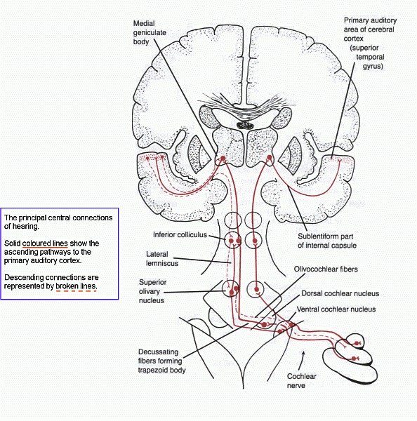

Cochlear Nerve
==============

The purpose of this repository is to investigate the sparse encoding of auditory signals and it's passage into the primary auditory cortex ([Cochlear nucleus](http://en.wikipedia.org/wiki/Cochlear_nucleus)) http://en.wikipedia.org/wiki/Vestibulocochlear_nerve

An intention is to use the [Numenta Platform for Intelligent Computing](http://numenta.org/ "Numenta | NuPIC") library at the highest level (only PreFrontal, and T2/T3?). Working down via the;  
* [Medial geniculate nucleus](http://en.wikipedia.org/wiki/Medial_geniculate_nucleus) (MGB to Brodmann area 41 (A1)), [Ventral posterior nucleus](http://en.wikipedia.org/wiki/Ventral_posterior_nucleus) to
* [Inferior colliculus](http://en.wikipedia.org/wiki/Inferior_colliculus) (Midbrain), 
* [Lateral lemniscus nuclei](http://en.wikipedia.org/wiki/Lateral_lemniscus) (Pons), 
* [Superior olivary complex](http://en.wikipedia.org/wiki/Superior_olivary_complex) (Pons), to
* [Cochlear nucleus](http://en.wikipedia.org/wiki/Cochlear_nucleus) (Medulla).

###### Suggested reading list

**To be reworkd** to take into account of [Mendeley](http://www.mendeley.com/), a free reference manager for PDFs.

[Spectral density](http://en.wikipedia.org/wiki/Spectral_density)  
[Critical band](http://en.wikipedia.org/wiki/Critical_band)  
[Equal loudness contour](http://en.wikipedia.org/wiki/Equal-loudness_contour)   
[Hair cell - Neural connection](http://en.wikipedia.org/wiki/Hair_cell#Neural_connection)  
[Nyquist Shannon sampling theorem](http://en.wikipedia.org/wiki/Nyquist%E2%80%93Shannon_sampling_theorem)  

- 
**Auditory-Based Processing of Communication Sounds**
Walters, Thomas C. (2011)  
http://scholar.google.co.uk/scholar?q=Auditory-Based+Processing+of+Communication+Sounds  

- 
**Frequency Selectivity of Voxel-by-Voxel Functional Connectivity in Human Auditory Cortex**
Kuwook Cha, Robert J. Zatorre and Marc Schönwiesner
http://cercor.oxfordjournals.org/content/early/2014/09/02/cercor.bhu193.abstract

- 
**Hemispheric Asymmetry for Auditory Processing in the Human Auditory Brain Stem, Thalamus, and Cortex**
Marc Schönwiesner, Katrin Krumbholz, Rudolf Rübsamen, Gereon R. Fink and D. Yves von Cramon
http://cercor.oxfordjournals.org/content/17/2/492.short

- 
**The Representation of Interaural Time Differences in High-Frequency Auditory Cortex**
Dina Moshitch and Israel Nelken
http://cercor.oxfordjournals.org/content/early/2014/09/26/cercor.bhu230.abstract

- 
**Heschl's Gyrus, Posterior Superior Temporal Gyrus, and Mid-Ventrolateral Prefrontal Cortex Have Different Roles in the Detection of Acoustic Changes**
Marc Schönwiesner, Nikolai Novitski, Satu Pakarinen, Synnöve Carlson, Mari Tervaniemi, and Risto Näätänen
http://classic.jn.physiology.org/content/97/3/2075.short

- 
**A Biomimetic, 4.5W, 120+dB, Log-domain Cochlea Channel with AGC**
A. G. Katsiamis, Student, Member IEEE, E. M. Drakakis, Member, IEEE and R. F. Lyon, Fellow, IEEE
Richard F. Lyons Google page; http://research.google.com/pubs/author35932.html  

- 
**Time domain modeling of peripheral auditory processing: A modular architecture and a software platform**  
Roy D. Patterson, Mike H. Allerhand and Christian Giguère (1995)  
http://scitation.aip.org/content/asa/journal/jasa/98/4/10.1121/1.414456  
http://scholar.google.co.uk/scholar?q=time+domain+modelling+of+peripheral+auditory+processing  

- 
**Segregating information about the size and shape of the vocal tract using a time-domain auditory model: The Stabilised Wavelet Mellin Transform**  
Toshio Irino and Roy D. Patterson, Speech Communication, 36 (3-4), pp.181-203, March 2002.  
http://www.pdn.cam.ac.uk/groups/cnbh/teaching/lectures/IPsc02.pdf  

- 
**Neural Coding of Periodicity in Marmoset Auditory Cortex**  
Daniel Bendor and Xiaoqin Wang  
http://web1.johnshopkins.edu/xwang/Publications_files/BendorWang_JN2010.pdf  

- 
**Periodicity coding in the inferior colliculus of the cat.**  
**_I. Topographical Organization AND II. Topographical Organization_**  
G. Langner, C. E. Schreiner, Journal of Neurophysiology  
http://www.ncbi.nlm.nih.gov/pubmed/3236052  

- 
**Patterning of pre-thalamic somatosensory pathways**  
Gabrielle Pouchelon, Laura Frangeul, Filippo M. Rijli and Denis Jabaudon (2012)  
http://scholar.google.co.uk/scholar?q=Patterning+of+pre-thalamic+somatosensory+pathways&hl=en&as_sdt=0&as_vis=1&oi=scholart&sa=X&ei=padSVPTzGsLhaPOjgagH&ved=0CCAQgQMwAA  
> **See** section _Ascending trigeminothalamic pathways_, follows _From whiskers to the brainstem trigeminal complex_  
> **And** Fig 1. Summary of pre-thalamic somatosensory pathways  

- 
**Binary Spiking in Auditory Cortex**  
Michael R. DeWeese, Michael Wehr, and Anthony M. Zador (2003)  
http://scholar.google.co.uk/scholar?q=Binary+Spiking+in+Auditory+Cortex  

- 
**Efficient coding of natural sounds**  
Michael S. Lewicki (2012)  
http://scholar.google.co.uk/scholar?q=Efficient+coding+of+natural+sounds  

- 
**Steady-state evoked potentials as an index of multisensory temporal binding**  
Sylvie Nozaradan, b, Isabelle Peretz, André Mouraux (2011)  
http://scholar.google.co.uk/scholar?q=Steady-state+evoked+potentials+as+an+index+of+multisensory+temporal+binding  

- 
**Auditory abstraction from spectro-temporal features to coding auditory entities**  
Gal Chechik and Israel Nelken (2012)  
http://www.pnas.org/content/109/46/18968.short  
http://www.ncbi.nlm.nih.gov/pmc/articles/PMC3503225/  

- 
**Unsupervised feature learning for audio classification using convolutional deep belief networks**  
Honglak Lee, Yan Largman, Peter Pham and Andrew Y. Ng. In NIPS*2009.  
http://ai.stanford.edu/~ang/papers/nips09-AudioConvolutionalDBN.pdf  

- 
**http://scholar.google.com/scholar?q=%22author%3ASch%C3%B6nwiesner%20author%3AM.%22**

- 
**http://research.microsoft.com/en-us/people/deng/**

##### Kaggle competitions

The Marinexplore and Cornell University Whale Detection Challenge  
http://www.kaggle.com/c/whale-detection-challenge  
http://danielnouri.org/notes/2014/01/10/using-deep-learning-to-listen-for-whales/  

MLSP 2013 Bird Classification Challenge  
https://www.kaggle.com/c/mlsp-2013-birds  

ICML 2013 Bird Challenge  
https://www.kaggle.com/c/the-icml-2013-bird-challenge  

But firstly, the creation of the SDR encoders.  

### Encoding for the Thalamocortical pathways

Before reaching the ventral division of the medial geniculate body of the thalamus (MGB), a variety of information processing needs to take place. A [sparse distributed representation](https://www.youtube.com/watch?v=LbZtc_zWBS4) ([SDR](https://github.com/numenta/nupic/wiki/Sparse-Distributed-Representations)), an array containing distributed bit encoded semantic meanings, is required to be sent into the Thalamocortical highways. Our highways (beltways?) will be built using NuPIC. 

http://en.wikipedia.org/wiki/Neuronal_encoding_of_sound

#### AIM - The Auditory Image Model

http://www.pdn.cam.ac.uk/groups/cnbh/research/aim.php  
http://www.acousticscale.org/wiki/index.php/Main_Page  
https://code.google.com/p/aimc/  

##### Processing stages in AIM

The principle functions of AIM are to simulate:

1. Pre-cochlear processing (PCP) of the sound up to the oval window of the cochlea,
2. Basilar membrane motion (BMM) produced in the cochlea,
3. The neural activity pattern (NAP) observed in the auditory nerve and cochlear nucleus,
4. The identification of maxima in the NAP that strobe temporal integration (STI),
5. The construction of the stabilized auditory image (SAI) that forms the basis of auditory perception,

Optionally; A size invariant representation of the information in the SAI referred to as the Mellin Magnitude Image (MMI).

The audible frequency range for adult humans is about 20 Hz to 16,000 Hz. With about 32,000 hair cells per ear in the cochlear. Maximum frequency 20k Hz for infants, 16k Hz for adults. Within this range, the human ear is most sensitive between 2 and 5 kHz, largely due to the resonance of the ear canal and the transfer function of the ossicles of the middle ear.

Via mechanotransduction (see organ of Corti, below), inner hair cells detect the motion of waves, and excite myelinated Type I (source?) neurons of the auditory nerve. Exocytosis of neurotransmitter vesicles at ribbon synapses, generates an action potential in the connected auditory-nerve fiber. 

The mechanotransduction by stereocilia is highly sensitive, and able to detect perturbations as small as fluid fluctuations of 0.3 nanometers. Converting this mechanical stimulation into an electrical nerve impulse in about 10 microseconds. 

Outer hair cells on the other hand boost the mechanical signal by using electromechanical feedback, a frequency specific boost and unmyelinated.  

Outer middle ear processing (PCP) can be approximated with 2nd order Butterworth filter? (Lf 450 Hz, Hf 8000 Hz). Need PCP for spatial locationing of sound (horizontal and vertical calculated in seperate neuronal clusters).

The basilar membrane of the cochlea is tonotopic. Location of middle ectosylvian gyrus, and tonotopic organization in approx. dorsoventrally across the gyrus.

Feature extraction (150 - 400 ms)  
 * relative piches (~1500 frequencies),  
 * peak absolute pitch, 
 * loudness, 
 * timbre, 
 * spatial location, 
 * reverb, 
 * tone duration, 
 * note onset times  

followed by,  
Feature inegration (100 - 150 ms)  

* Tuning on the basilar membrane changes from high to low frequency.  
* Auditory filters that are non-linear, level-dependent.
* Filter critical bandwidth size decreases from the base to apex of the cochlea (high to low)

Can feedback from unmyelinated cortical neurons handle attentional auditory processing? Via the inferior colliculus?

Feedback from the tensor tympani and stapedius muscles could also be determined to deduce energy state information from ossicle simulation?

Thalamic reticular nucleus (TRN) neurons (targets medial geniculate body (MGB)), may transiently deactivate surrounding TRN neurons in response to fresh stimulus, altering auditory thalamus responses and inducing attention shift?  

Individual subdivisions of the medial geniculate body (MG) receive a majority of their ascending inputs from 1 or 2 subdivisions of the inferior colliculus (IC). This establishes parallel pathways that provide a model for understanding auditory projections from the IC through the MG and on to auditory cortex. 

- Spectro-Temporal Receptive Field (STRF) estimated from the responses to relevant complex stimuli  
- Volterra integral representation?  
- Processing of spatial cues all pre-isothalamic?  
- Planum Temporale involved in absolute pitch (AP)?  
- Structure cortical region BA44 & Meaning BA47  
- Pars Orbitalis, temporal coherence in Brodmann area 47?  
- Speech and music divergence (phoneme recognition)?  

### The pathways of our hearing

### Anatomy of the Human Ear

http://en.wikibooks.org/wiki/Sensory_Systems/Auditory_System

 "<a href="http://commons.wikimedia.org/wiki/File:Anatomy_of_the_Human_Ear.svg#mediaviewer/File:Anatomy_of_the_Human_Ear.svg">Anatomy of the Human Ear</a>" by Chittka L, Brockmann A - <a rel="nofollow" class="external text" href="http://biology.plosjournals.org/perlserv/?request=get-document&amp;doi=10.1371/journal.pbio.0030137&amp;ct=1">Perception Space—The Final Frontier, A PLoS Biology Vol. 3, No. 4, e137 doi:10.1371/journal.pbio.0030137</a> (<a rel="nofollow" class="external text" href="http://biology.plosjournals.org/perlserv/?request=slideshow&amp;type=figure&amp;doi=10.1371/journal.pbio.0030137&amp;id=24748">Fig. 1A</a>/<a rel="nofollow" class="external text" href="http://www.plosbiology.org/article/showImageLarge.action?uri=info%3Adoi%2F10.1371%2Fjournal.pbio.0030137.g001">Large version</a>), vectorised by <a href="//commons.wikimedia.org/wiki/User:Inductiveload" title="User:Inductiveload">Inductiveload</a>. Licensed under <a href="http://creativecommons.org/licenses/by/2.5" title="Creative Commons Attribution 2.5">CC BY 2.5</a> via <a href="//commons.wikimedia.org/wiki/">Wikimedia Commons</a>.

### Organ of corti

 "<a href="http://commons.wikimedia.org/wiki/File:Organ_of_corti.svg#mediaviewer/File:Organ_of_corti.svg">Organ of corti</a>" by <a href="//commons.wikimedia.org/wiki/User:Madhero88" title="User:Madhero88">Madhero88</a> Licensed under <a href="http://creativecommons.org/licenses/by-sa/3.0" title="Creative Commons Attribution-Share Alike 3.0">CC BY-SA 3.0</a> via <a href="//commons.wikimedia.org/wiki/">Wikimedia Commons</a>.

### Uncoiled cochlea with basilar membrane

 "<a href="http://commons.wikimedia.org/wiki/File:Uncoiled_cochlea_with_basilar_membrane.png#mediaviewer/File:Uncoiled_cochlea_with_basilar_membrane.png">Uncoiled cochlea with basilar membrane</a>" by Kern A, Heid C, Steeb W-H, Stoop N, Stoop R - <a rel="nofollow" class="external text" href="http://www.ploscompbiol.org/article/info:doi/10.1371/journal.pcbi.1000161">Biophysical Parameters Modification Could Overcome Essential Hearing Gaps</a> (<a rel="nofollow" class="external autonumber" href="http://www.ploscompbiol.org/article/showImageLarge.action?uri=info%3Adoi%2F10.1371%2Fjournal.pcbi.1000161.g002">[1]</a>). Licensed under <a href="http://creativecommons.org/licenses/by/2.5" title="Creative Commons Attribution 2.5">CC BY 2.5</a> via <a href="//commons.wikimedia.org/wiki/">Wikimedia Commons</a>.

