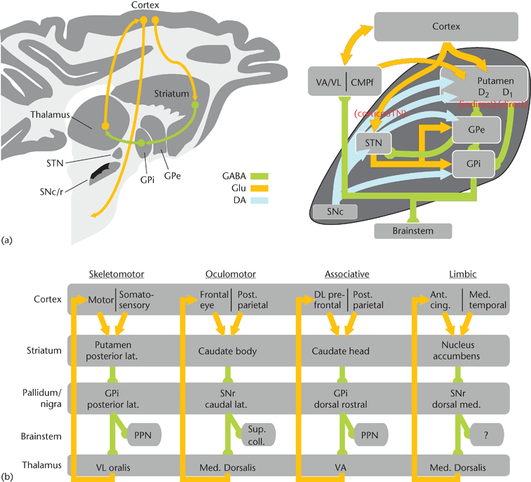

# Notes taken from my note book

These thoughts are a few months old now, but show progress learning a new subject as complex as neuroscience.

Bifurcation and gating of a NuPIC neuron?...
After Numenta's step ahead with their neuron remodelling, what other cell types will fit NuPIC?...
Region redundancy through relay cells?...
Reduced minicolumn stacked regions for cascading inhibitory events?

## Working memory:

* OFC - Integration of infomation that derives value of potential reward outcomes
-  Connects to...
-    MPFC and DLPFC...
-  Input ...
-    - Sensory information...
-    - Affective information (eg. Amygdala, emotions and drive)...
-    - Motivational information (eg. Hypothalamus, feelings)...

* DLPFC - Construction of plan to obtain reward outcome
-  Connects to...
-    MPFC and DLPFC...
-  Outputs to...
-    Behavioural response...

* MPFC - Evaluation of effort involved in plan
-  Connects to...
-    MPFC and DLPFC...
-  Outputs to...
-    Behavioural response...

Short term 'Echoic' 15 - 20 seconds

## Concepts (Basal Ganglia):

Turner, Robert S(Sep 2009) Basal Ganglia and The Regulation of Movement. In: eLS. John Wiley & Sons Ltd, Chichester. http://www.els.net [doi: 10.1002/9780470015902.a0000020.pub2]

Key;
* GPe - External segment of the Global Pallidus
* GPi - Internal segment of the Global Pallidus
* SNr - Substantia Nigra pars reticulata
* SNc - Substantia Nigra pars compacta (dopamine containing)
* AC  - Anterior Commissure
* STN - Sub Thalamic Nucleus

Thalamus predicting action plan feedback? Sending projections back in as potential actions to choose?

Sensorimotor cortices, Associative cortices, and Limbic cortices projecting through AC, Nucleus Accumbens to GPe, GPi, SNr, and SNc

- The BG is organized as anatomically segregated loop circuits that contribute to the control of movement, cognition and motivation.
- All BG circuits share a common basic organization.
- Input projections from cortex and thalamus terminate as excitatory synapses in the striatum and subthalamic nucleus.
- Output projections tonically inhibit target neurons in thalamic and brainstem nuclei.
- Direct and indirect pathways connect input and output nuclei of the BG.
- Activation of the direct pathway facilitates movement whereas activation of the indirect pathway suppresses movement.
- A variety of neuromodulators, such as dopamine, affect the activity of neurons in the direct and indirect pathways differently.
- Most BG-related clinical conditions (e.g. Parkinson disease) arise from imbalanced activation of direct and indirect pathways and involve abnormal discharge patterns in BG output neurons.
- BG circuits may regulate how an animal allocates time and effort to movements and actions and act as a tutor for new skill learning.

...
Remember - Recruiting same group of neurons used during perception to recollect

Planum Temporale involved in absolute pitch (AP) ?...
Pars Orbitalis, temporal coherence in Brodmann area 47...
Musical structure analysis 150 - 400 ms...
Musical meaning analysis 100 - 150 ms later...
Speech and music divergence (phoneme recognition)...
Structure BA44 & Meaning BA47...

- Feature extraction
- Feature inegration (or inference?)
- Absolute pitch, timbre, spatial location, loudness, reverb, tone duration, onset times for different notes

Constructivist vs. Record keeping view...
Experience traces, prototypes, multiple trace memory models, memory "chunking"

???
Before learning layer 2 and layer 3b firing, but after learning level 2 fires but layer 3a inhibits 3b, therefore forming a "name" and stable pattern that unfolds to sequences...
Layer 5 higher region (t-1, previous prediction) L6 higher region (name of sequence, more stationery)...
Stable feedback invokes union of sparse states in multiple sequences...
All firing equates to "voting" that the input fits its label...
Classification and determining from active columns whether this representation fits is difficult?...

Reward prediction error signals...
Attention...
Feedback between regions...
Specific timing...
Behaviour/sensory-motor integrations...
Classification and sequence formation, modifying and adapting...
Auto associate memory formed by cortical columns...
Unfolded representations can split (bifucate) to multiple HTMs and sensor/motor regions and control. Creates invariant... representations. Region predicts "name" and projects to higher region and unfold down heirarchy...
Motor control initially relies on pre-defined valid named sequences. Its higher HTM learns sequences of sequences. Learning (pre birth) accelerated by use of predefined sequences...
Predefined sequences encode time variance, but can it predict physical constraints? pain feedback inhibition?...
Autonomic ganglian chains?...
Valid predefined motor sequence implies that transitional sequences are likely to be valid. Some will be impossible...
Sequence 'unfolding' as it moves back down the heirarchy...

## Striatum
Helps coordinate motivation within body movements (can inhibit behaviour).

Cerebral cortex to Striatum to Basal Ganglia...
Does the BG act as a reinforcement driven tutor for learning automatic behavioural routines?...
Temporaly coordinated firing patterns (result from learning)...
TRAIN the Putamen (via Cerebellum?)...

## Putamen

Stores "subconcious" memories, such as motor skills gained by repetition. Hippocampas establishes longer term memories (need for REM sleep?)

Spinal pattern generators?...
D1 direct into interior of Globus Pallidus to excite?...
D2 indirect to exterior of Globus Pallidus to inhibit?...
GP connection?...
Why SNc and GPi to brain stem? What other connections, cerebellum, thalamus?...
SN receives input projections and performs selection? Yes, with reward based...
(Lateral) Habenular complex?...

## Basal Ganglia

- Two parallel systems;
Dorsal striatal-dorsal pallidal system, including the Caudate Nucleus, Putamen, Globus Pallidus (main target of nigrostriatal system)...
Ventral striatal-ventral pallidal system, including Nucleus Accumbens and related structures and Ventral Pallidum (main target of Limbic midbrain dopamine reward system)

Caudate Nucleus involvement in intention and drive?...
Cause of catatonia?...
Thalamus providing short-latency "alerting" signals to Amygdala in relation to fearful noises or other arosing stimuli...

GABA - Principal INHIBITORY...
Glu(tamate) - Principal EXCITATORY...
Endocrine (Hypothalamus)...
Neuropeptidue containg neurons and axons...
Amacrine cells (retina)...
Boutons rich in mitochondria...
Nerouhistologist...

Are EPSP & IPSP used in NuPIC?...
Seccades can be up to 600 degrees per second...
Seccade, Vergence, Pursuit (follow slow movement)...
Vestibular Ocular Reflex (VOR)...
OptoKinetic reflex...
Koniocellular pathway? potentially class2 (thalamic) modulatory...
Parvocellular pathway; foveal vision for detailed colour vision (into 4CBeta) Arrives after magnocelluar path...
Magnocellular pathway; peripheral vision for sensitive transient signal detection (motion and events) (into 4CAlpha)...

10 - 20 % Eye - Superior Colliculus - Eye (driving seccading)...
20 - 90 % Into V1 via LGN...

Second loop - Eye to LGN to V1 to SC to Eye...
Frontal Eye Field - FEF to SC to make a voluntary seccade...

"Pinwheel" centers around area 17/18 transition zone in cat V1...
"Response Kinetics" van Hatere, H. 2005...
Benh-Shahar et al. 2003 V1 salency...

## Lateral Geniculate Nucleus

LGN - Relay retinal messages

Ventral Posterior Nucleus...
POv Relay from spinothalamic tract...
Parabrochial cells involvment in labelling and **dual labelling**?
